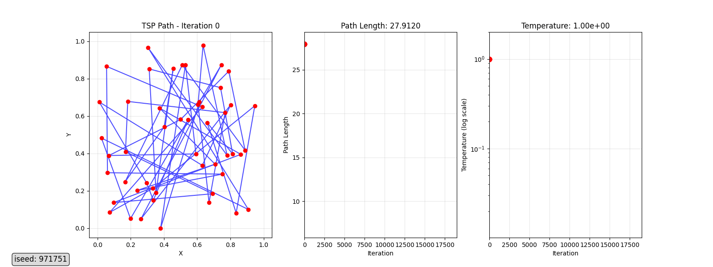
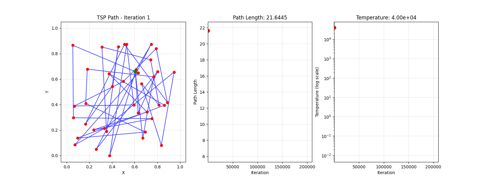
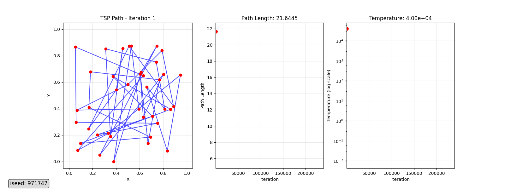
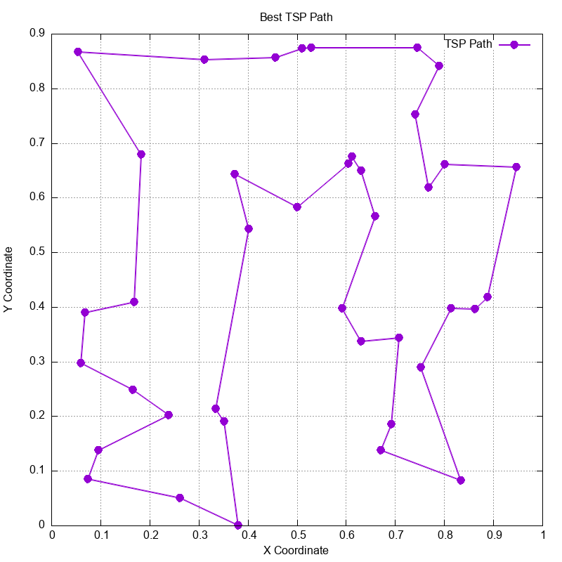

# Tackling the Travelling Salesman Problem using Simulated Annealing in Fortran.
A Fortran program that randomly generates N cities then attempts to find the shortest round trip path between them, using the simulated annealing & metropolis acceptance criterion to avoid getting stuck in local minima.



## Overview

### V1 (`TSP_SIM_ANN.f90`)
The first version of the program:
- used random 2 city swaps to test new paths
- featured 2 different annealing schedules; an initial fast cooling that served as a starting point for a slower second cooling schedule.
- Had a ridiculous O runtime, ran 100 samples of up to ~1M iterations each.
- Achieved ~14.3 mean path length.

### V2  (`V2_TSP_SIM_ANN.f90`)
Rewrote the program to make the following improvements:
- Replaced the random 2 city swaps with 3-5 city segment reversal and segment transport.
- Path crossings were significantly reduced by these segment operations since they were optimising localised "neighbourhoods".
- 0.9 exponential cooling schedule with a fixed attempt budget per temperature level.
- Runs 10 samples, achieves ~6-7 path length with far fewer total iterations.

## O(1) Path Length Calculation

A significant improvement to the code was implimented by computing the path length changes by evaluating only the 2 to 4 edges affected by a move, rather than recalculating the entire tour every time a new path was set. This reduced the cost function evaluation from O(N) to O(1).

## Visualisation

V1 animation of random swaps, but with improved O(1) path length calculation:


Extended runtime version of random swaps algorithm:


Gnuplot script (`plot.gp`) to quickly check weather the path was feasable during early development:


## Building & Running

Compile with gfortran (or any Fortran 90 compiler):

```bash
# V1
gfortran TSP_SIM_ANN.f90 -o tsp_v1
./tsp_v1

# V2
gfortran V2_TSP_SIM_ANN.f90 -o tsp_v2
./tsp_v2
```

Generate the animation (requires Python 3, matplotlib, Pillow):

```bash
python TSP_animation.py
```

Generate the static best-path plot (requires gnuplot):

```bash
gnuplot plot.gp
```
